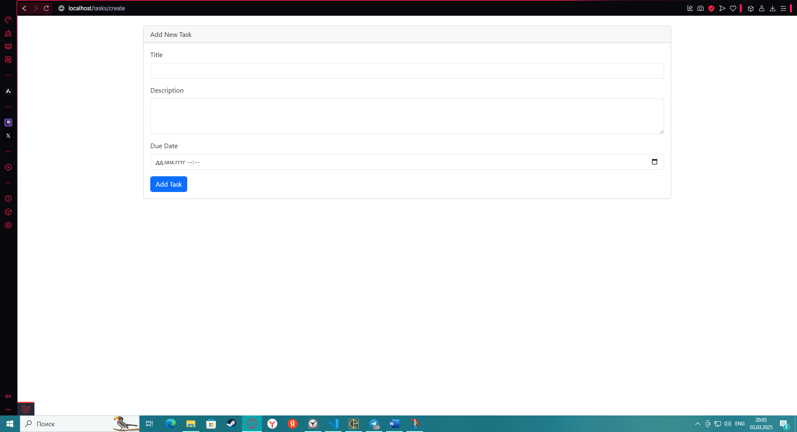

Проект представляет собой CRUD-приложение для создания, редактирования, просмотра и удаления задач. Он разработан с использованием Laravel (PHP-фреймворк) и Bootstrap для адаптивного дизайна. Приложение позволяет пользователям эффективно управлять своими задачами, отслеживать их статус и сроки выполнения.

Основные функции проекта:
1. Управление задачами (CRUD) 
Создание задач:

Пользователь может добавить новую задачу, указав:

Название задачи

Описание задачи

Срок выполнения (дата и время)

Статус задачи (выполнена, в процессе, не выполнена)

Валидация всех полей перед сохранением.

Просмотр задач:

Список задач отображается в виде таблицы с возможностью сортировки и фильтрации.

Для каждой задачи отображается:

Название

Описание (с возможностью просмотра полного текста через тултип)

Срок выполнения

Статус (с цветовой индикацией)

Кнопки действий (редактирование, удаление)

Редактирование задач:

Редактирование задачи через модальное окно.

Все поля можно изменить, включая статус.

Удаление задач:

Удаление задачи с подтверждением действия.

Защита от случайного удаления.

2. Фильтрация задач[главная страница с задачими и кнопками фильтрации](./img/img2.png)
Пользователь может фильтровать задачи по статусу:

Все задачи

Выполненные

В процессе

Не выполненные

Фильтрация сохраняется при сортировке и пагинации.

3. Сортировка задач
Задачи можно сортировать по:

Дате создания (новые/старые сначала)

Названию (алфавитный порядок)

Текущее направление сортировки отображается с помощью иконок стрелок.

4. Адаптивный дизайн
Приложение корректно отображается на всех устройствах:

Настольные компьютеры

Планшеты

Мобильные устройства

На мобильных устройствах некоторые колонки скрываются для экономии места.

5. Статусы задач
Каждая задача может иметь один из трех статусов:

Выполнена (зеленый цвет)

В процессе (желтый цвет)

Не выполнена (красный цвет)

Статус отображается в виде цветного бейджа.

6. Модальное окно редактирования[модальное окно редактирования задачи](./img/img3.png)
Редактирование задачи происходит в модальном окне без перезагрузки страницы.

Все поля формы предзаполняются текущими значениями задачи.

7. Пагинация
Список задач разбит на страницы для удобства просмотра.

Пагинация сохраняет текущие параметры фильтрации и сортировки.

8. Валидация данных
Все формы защищены валидацией:

Название и описание обязательны.

Дата выполнения должна быть корректной.

Статус задачи должен быть одним из допустимых значений.

9. Логирование и обработка ошибок
Все действия (создание, редактирование, удаление) логируются.

Ошибки обрабатываются и выводятся пользователю в понятном виде.

10. Интерактивные элементы
Тултипы:

При наведении на сокращенное описание задачи отображается полный текст.

Иконки:

Используются иконки Bootstrap для визуального улучшения интерфейса.

Подтверждение действий:

Удаление задачи требует подтверждения.